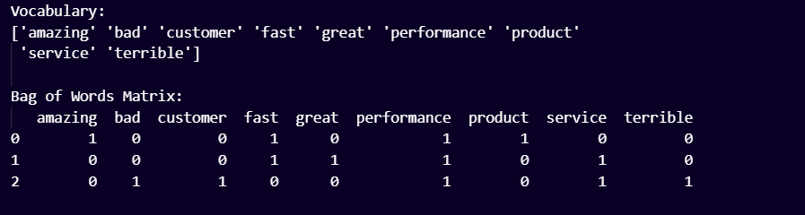
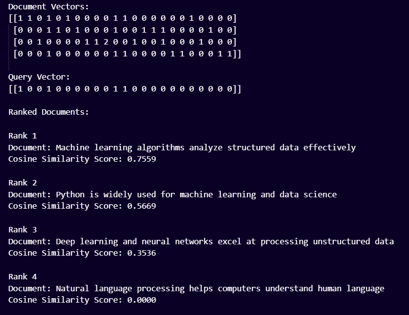

# NLP Lab Assignment

Bag of Words Matrix Construction & Document Search Engine

**Name:** Ayesha Noor  
**Roll Number:** 2K24-AI-17
**Course:** Natural Language Processing  
**Lab:** Lab 04

### Introduction

This lab assignment demonstrates two basic Natural Language Processing (NLP) techniques using Python and Scikit-learn:

1. **Bag of Words (BoW) Matrix Construction**
2. **Document Search Engine and Relevance Ranking using Cosine Similarity**

The assignment uses `CountVectorizer` to convert text into numerical representations and `cosine_similarity` to measure the relevance between a search query and documents.

---

# Task 1: Bag of Words Matrix Construction

## Objective

The objective of Task 1 is to construct a vocabulary from customer reviews and generate a **Term-Frequency (Bag of Words) matrix** using `CountVectorizer` with English stop words removed.

## Input Corpus

```python
corpus = [
    "The product performance is amazing and fast",
    "The service was fast and performance was great",
    "Terrible customer service and bad performance"
]
```

## Method Used

The following steps were performed:

* `CountVectorizer(stop_words='english')` was instantiated.
* The corpus was transformed into a numerical sparse matrix using `fit_transform()`.
* The vocabulary was extracted using `get_feature_names_out()`.
* The sparse matrix was converted into a Pandas DataFrame for structured presentation.

## Output Screenshot – Task 1





## Task 1 Result

The resulting vocabulary contains the important words from the customer reviews after removing common English stop words such as **the, is, and, was**.

The Bag of Words matrix represents each review numerically. Each column represents a vocabulary word, while each row represents a document/review. The value indicates how many times that word occurs in the corresponding review.

---

# Task 2: Document Search Engine & Relevance Ranking

## Objective

The objective of Task 2 is to build a simple document search engine that accepts a search query and ranks documents according to their **Cosine Similarity** scores.

## Input Documents

```python
documents = [
    "Machine learning algorithms analyze structured data effectively",
    "Deep learning and neural networks excel at processing unstructured data",
    "Natural language processing helps computers understand human language",
    "Python is widely used for machine learning and data science"
]
```

## Search Query

```python
query = ["machine learning algorithms for data"]
```

## Method Used

The following steps were performed:

1. `CountVectorizer` was fitted on the documents.
2. The documents and search query were converted into numerical vectors.
3. Pairwise cosine similarity was calculated using:

```python
cosine_similarity(query_vector, doc_vectors)
```

4. Documents were sorted according to their similarity scores from highest to lowest.
5. The document with the highest score was considered the most relevant document for the query.

## Output Screenshot – Task 2





## Task 2 Result

The document containing the highest number of important words related to the query receives the highest cosine similarity score and is ranked first.

For the given query:

```text
machine learning algorithms for data
```

the first document is expected to be the most relevant because it contains several important terms from the query, including **machine, learning, algorithms, and data**.

---

# Task 5: Lab Viva & Reflection Questions

## Question 1: Word Order Invariance

### Question

Why does the sentence **"Dog bites man"** have the exact same Bag of Words representation as **"Man bites dog"**? How does this impact sentiment analysis?

### Answer

Bag of Words represents a sentence by counting the occurrence of individual words without considering their order.

For example:

**Dog bites man**

and

**Man bites dog**

contain the same three words:

* dog
* bites
* man

Therefore, both sentences receive the same Bag of Words representation.

This is a major limitation of the Bag of Words model because word order can change the meaning of a sentence. In this example, the subject and object are different, but BoW cannot understand this difference.

For sentiment analysis, this limitation can cause incorrect predictions when word order changes the meaning or context of a sentence. BoW also struggles with phrases such as negation, for example **"not good"**, because it mainly focuses on word occurrence rather than the relationship and order between words.

---

## Question 2: Sparsity Issue

### Question

What happens to the memory size and density of the BoW matrix when the corpus contains **100,000 unique vocabulary words**?

### Answer

When the corpus contains 100,000 unique vocabulary words, the Bag of Words matrix becomes very large because each unique word is represented as a separate column.

Most documents contain only a small portion of the complete vocabulary. Therefore, most entries in the matrix will be **zero**.

This creates a **sparse matrix**.

As the vocabulary grows:

* The number of columns increases significantly.
* The total memory requirement increases.
* The matrix becomes mostly zeros.
* Storing the matrix as a normal dense matrix can waste a large amount of memory.

For this reason, NLP libraries such as Scikit-learn usually represent BoW results as **sparse matrices**, which store mainly the non-zero values and are much more memory-efficient.

---

## Question 3: Zero Similarity

### Question

Explain why **Document 3** in Task 2 receives a Cosine Similarity score of zero for the query:

```text
machine learning algorithms for data
```

### Answer

Document 3 is:

```text
Natural language processing helps computers understand human language
```

After applying `CountVectorizer` with English stop words removed, Document 3 does not contain the important vocabulary terms from the search query such as:

* machine
* learning
* algorithms
* data

Therefore, the vector representing Document 3 has no common non-zero terms with the query vector.

Cosine similarity measures the similarity between two vectors based on their direction. When two vectors have no common terms and the dot product is zero, their cosine similarity becomes:

```text
0
```

Therefore, Document 3 receives a **Cosine Similarity score of 0**, meaning that it has no meaningful word overlap with the given search query.

---

# Conclusion

This lab demonstrated how text data can be converted into numerical representations using **CountVectorizer** and how documents can be ranked according to their relevance using **Cosine Similarity**.

Task 1 showed the construction of a Bag of Words matrix, while Task 2 demonstrated a simple search engine that ranks documents based on their similarity to a query.

The viva questions also highlighted important limitations of the Bag of Words approach, including **word order invariance** and **matrix sparsity**.

---

# Technologies Used

* Python
* Scikit-learn
* Pandas
* CountVectorizer
* Cosine Similarity
* Bag of Words (BoW)
* Natural Language Processing (NLP)
